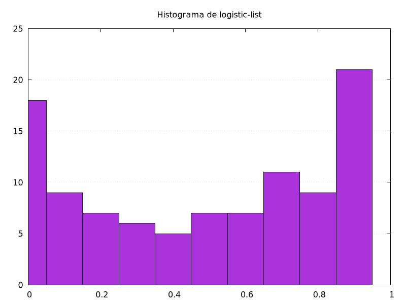
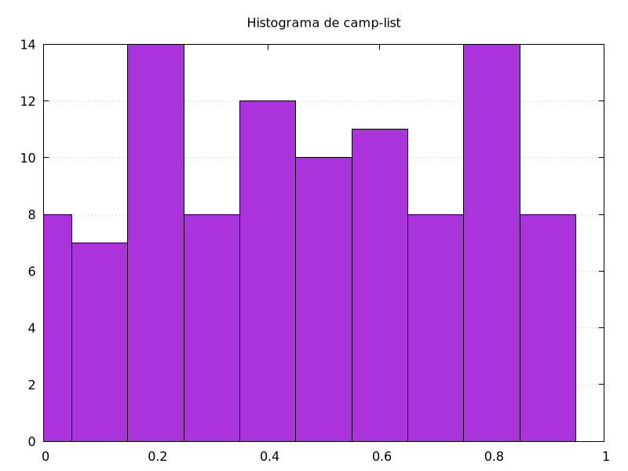
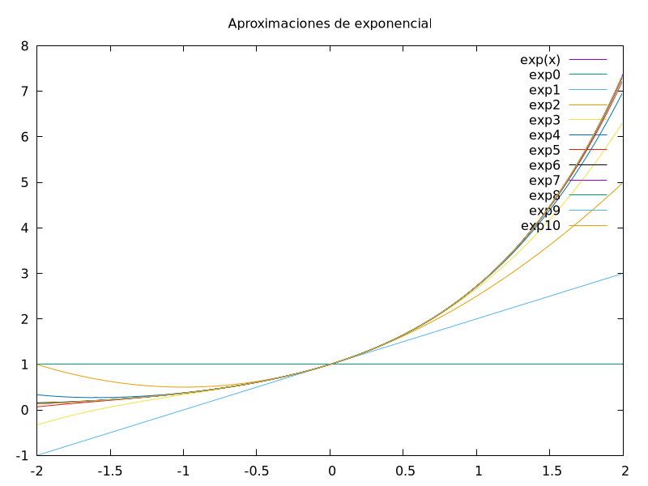
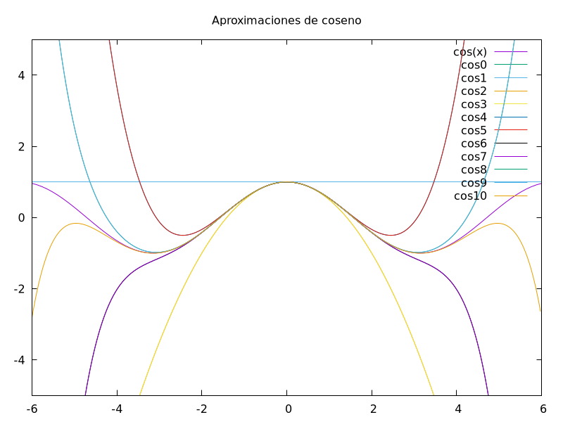

# Taller_01 - Maching Learning
- Christian Marroquín, Julian Medina
# Ejercicios
## Numeros pseudoaleatorios
- Realizar generadores de numeros pseudoaleatorios (tend map, logistic map) y calcular estadisticas (media, varianza, coeficiente de asimetria, histograma).
### Resultados:
- estadisticas para 100 valores aleatorios
``` md
# logistic map
mean=0.526487
var=0.118214
asymetry=-0.118942

# tent map
mean=0.514378
var=0.079439
asymetry=-0.041304
```
- histogramas

|  |  |
| - | - |
- [codigo](rand_gen.c).
## Taylor
- Realizar aproximaciones de Taylor para la función exponencial y una función de nuestra elección (*coseno*).
### resultados
- evaluacion de funciones
```
# taylor aprox n = 10
e = 2.718282
cos(1) = 0.540303
```
- graficas

Se calcularon multiples aproximaciones de taylor de diferentes grados y se muestran en la misma grafica para la función exponencial y coseno.

| funcion | grafico |
| - | - |
| $e^x$ |  |
| $\cos (x)$ |  |
- [codigo](taylor.c)

Se realizó una función *taylor*, que recibe los coeficientes de la n-esima derivada en el punto al cual se realiza la expasión.
## Newton-Rhapson
